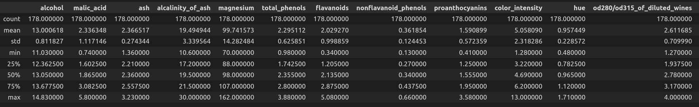
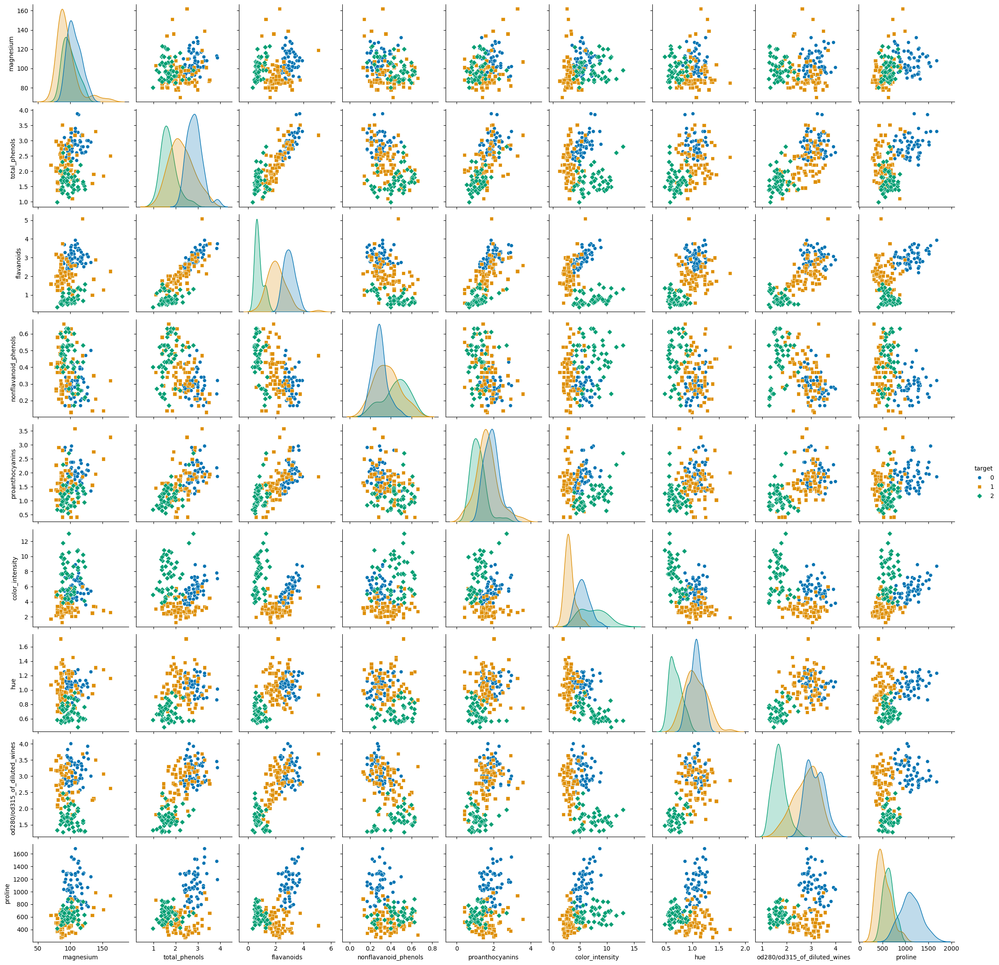

# Decision Tree Pruning Analysis  

## Introduction  
Pruning is a technique used in decision trees to reduce overfitting and improve generalization. In this experiment, we compare the impact of pruning on decision tree performance using two different approaches. The experiment is conducted on the Wine dataset across multiple random states to evaluate the consistency of pruning effects.  
## Exploratory Data Analysis
An exploratory analysis was performed on the data to gain insights into its structure and characteristics.
### First Five Rows

### Summary Statistics

### Feature Relationship Visualization

The dataset has many features with good distribution to use but the number of samples makes this task challenging as it is hard to avoid a biased training dataset. This  problem will also be observed in the next part showing inefficiency of pruning.  
## Results  

### Accuracy Comparison  

| Random State | Unpruned Accuracy | Pruned Accuracy | Custom Pruned Accuracy (α = 0.05) | Custom Pruned Accuracy (α = 0.1) | Custom Pruned Accuracy (α = 0.2) |
|-------------|------------------|----------------|---------------------------------|---------------------------------|---------------------------------|
| 1           | 0.75             | 0.53           | 0.53                            | 0.53                            | 0.42                            |
| 2           | 0.92             | 0.75           | 0.75                            | 0.75                            | 0.75                            |
| 3           | 0.78             | 0.64           | 0.64                            | 0.64                            | 0.64                            |
| 4           | 0.53             | 0.53           | 0.53                            | 0.56                            | 0.56                            |
| 5           | 0.83             | 0.69           | 0.75                            | 0.75                            | 0.39                            |

**Mean Accuracy across Random States:**  
- **Unpruned:** 0.76  
- **Pruned:** 0.63  
- **Custom Pruned (α = 0.05):** 0.64  
- **Custom Pruned (α = 0.1):** 0.64  
- **Custom Pruned (α = 0.2):** 0.55  

---

## Discussion  

### Impact of Pruning on Accuracy  
From the results, pruning generally reduces accuracy compared to the unpruned decision tree. The mean test accuracy dropped from **0.76 (unpruned)** to **0.63 (pruned)**, indicating that pruning led to a simpler model but at the cost of performance. This suggests that the original decision trees might not have been excessively overfitting, as the model did not have enough samples in the first place, making aggressive pruning less beneficial.  

### Reduced Error Pruning vs. Custom Pruning  
The **reduced error pruning** method resulted in a mean accuracy of **0.63**, whereas the **custom pruning** method with α values of 0.05 and 0.1 resulted in slightly better accuracy (**0.64**). However, when α was set to 0.2, the accuracy dropped significantly to **0.55**, indicating over-pruning. This suggests that **mild pruning (α = 0.05, 0.1) may help reduce complexity without drastically impacting accuracy**, whereas higher α values can remove too many important nodes.  

### Effect of α on Custom Pruning  
- **Lower α values (0.05, 0.1)** resulted in pruning with minimal impact on accuracy, which may suggest that only a few weak branches were removed.  
- **Higher α value (0.2)** pruned the tree more aggressively, leading to a significant drop in accuracy (as seen in random states 1 and 5).  
- This confirms that **higher α leads to more aggressive pruning**, reducing model complexity but at the cost of performance.  

### Challenges and Insights  
- Despite the stratified splits to avoid biased partitions **Randomness in dataset splits** influenced the pruning impact, as seen in variations across different random states.
- **Choosing the right α value** is crucial—too small has little effect, while too large can severely impact accuracy.  
- **The Wine dataset** probably does not suffer from severe overfitting, as pruning did not consistently improve accuracy, meaning other regularization techniques like feature selection or hyperparameter tuning may be more effective.  

---

## Conclusion  
The results are honestly worse than I expected. This is probably due to the selected features are not best for this task but feature selection is beyond of this assignment.
As mentioned above pruning simplifies decision trees but can negatively impact accuracy if too aggressive. Reduced error pruning and custom pruning with **lower α values (0.05, 0.1)** performed similarly, while **higher α values (0.2)** led to over-pruning.   

